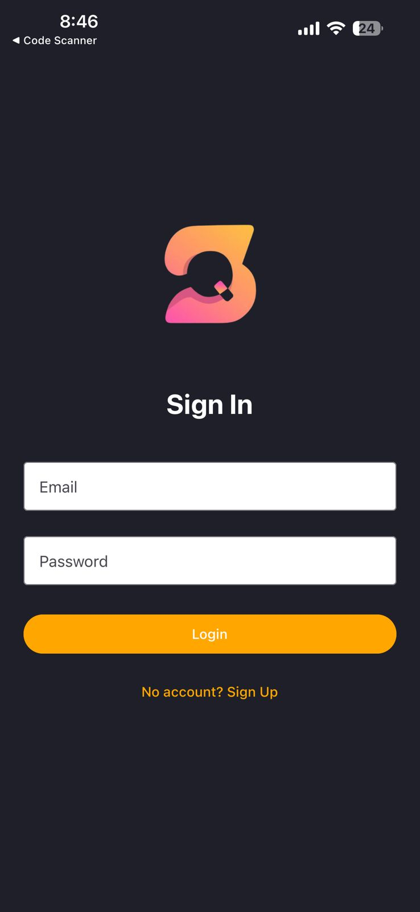
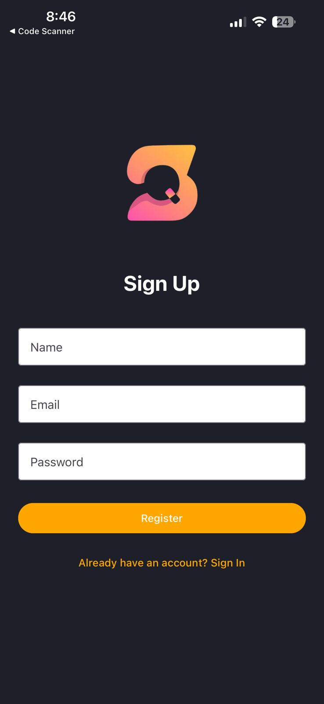
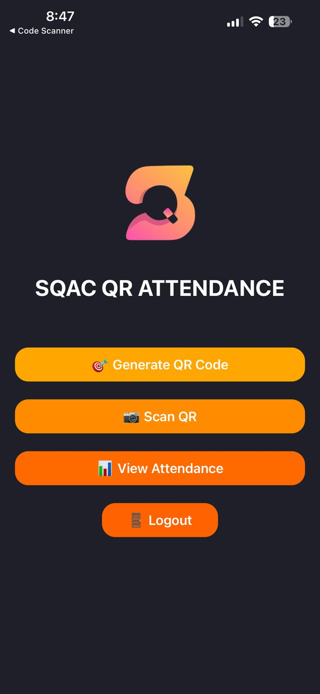
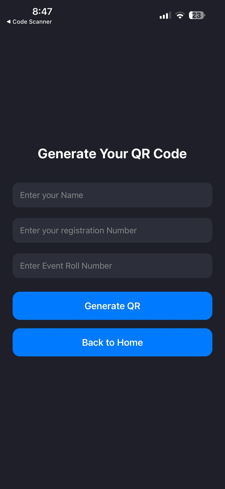
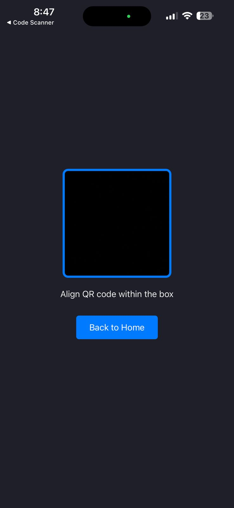
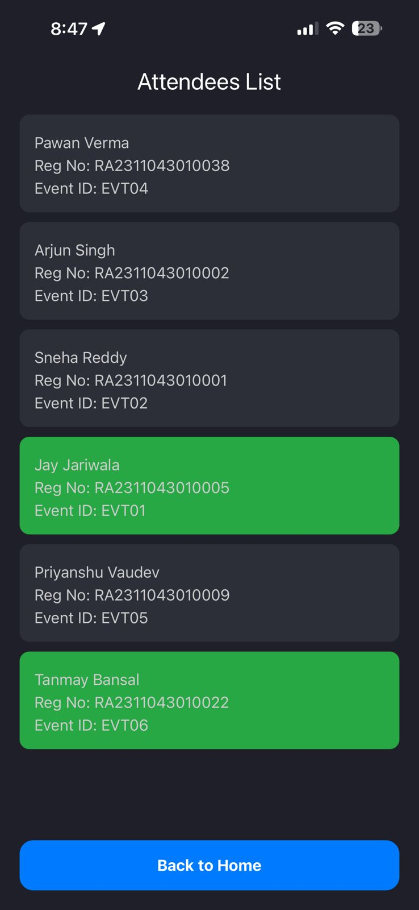

# QR Attendance App

Welcome to the **QR Attendance App**, a universal React Native application built using [Expo Router](https://expo.dev/router). This app streamlines event attendance by scanning QR codes containing participant details and marking them locally — no server required!

---

## 🚀 Features

- ✅ **QR Code Scanning** – Scan QR codes using your phone's camera.
- 👤 **Local Matching** – Match scanned data (`name`, `regno`, `event_id`) against a locally stored attendee list.
- 🔐 **Appwrite Authentication** – Sign up and log in securely with Appwrite.
- 🌐 **PWA Support** – Installable as a web app with "Add to Home Screen" functionality.
- 🧭 **Expo Router Navigation** – Organized using file-based routing.
- 📄 **Attendance Log** – View scanned and marked attendees within the app.

---
## These are some of the demo images of the app.
<p align="left">
  
  
  
</p>
<p align="left">
  
  
  
</p>


---


## 🛠️ Getting Started

1. **Install dependencies**
```bash
   npm install
```
2. Run the app
  ```bash
   npx expo start
  ```

---


## Then choose how to open the app:
- 🤳 Scan QR with Expo Go
- 📱 Android or iOS Simulator
- 🌐 Open in Web Browser (for PWA)

---


## 📁 Project Structure
This project uses Expo Router for navigation. All screens and logic are located in the app/ directory. Auth, scanning, and attendance logic are modular and reusable.

---


## 🧼 Reset Starter Code
To reset the app to a blank slate:
```bash
npm run reset-project
```
This will move starter code to app-example/ and provide a clean app/ folder.

---


## 📚 Learn More
- 📖 [Expo Documentation](https://docs.expo.dev)
- 🧭 [Expo Router](https://expo.dev/router)
- 📷 [Expo Camera](https://docs.expo.dev/versions/latest/sdk/camera/)
- 🔐 [Appwrite Docs](https://appwrite.io/docs)
- 🌐 [PWA in Expo](https://docs.expo.dev/workflow/pwa/)

---


## 💬 Community & Support
- [Expo on GitHub](https://github.com/expo/expo)
- [Expo Discord](https://discord.com/invite/expo)
- [Appwrite Discord](https://discord.com/invite/GSeTUeA)
